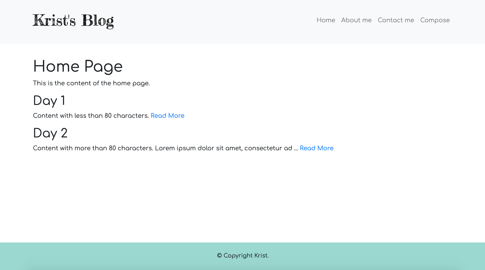
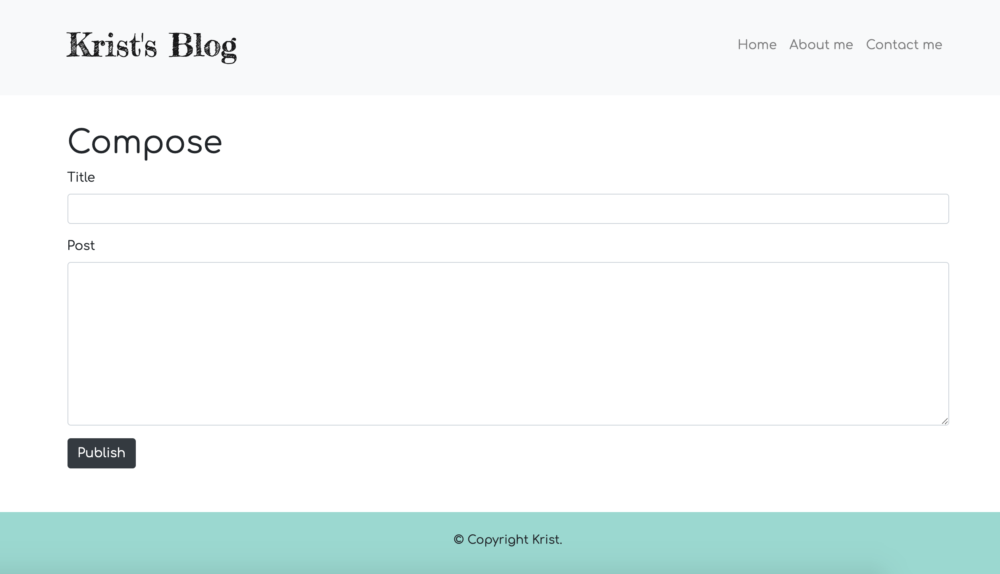

# blog-website
A simple blog website.

This Project is based on Angela's online web development course on Udemy.

The course link: https://www.udemy.com/course/the-complete-web-development-bootcamp/

### Frameworks
HTML/CSS + JavaScript + Bootstrap + Node.js + Express + EJS + Mongoose

# Screenshots
### home-page

### contact-page

### post-page

### compose-page

